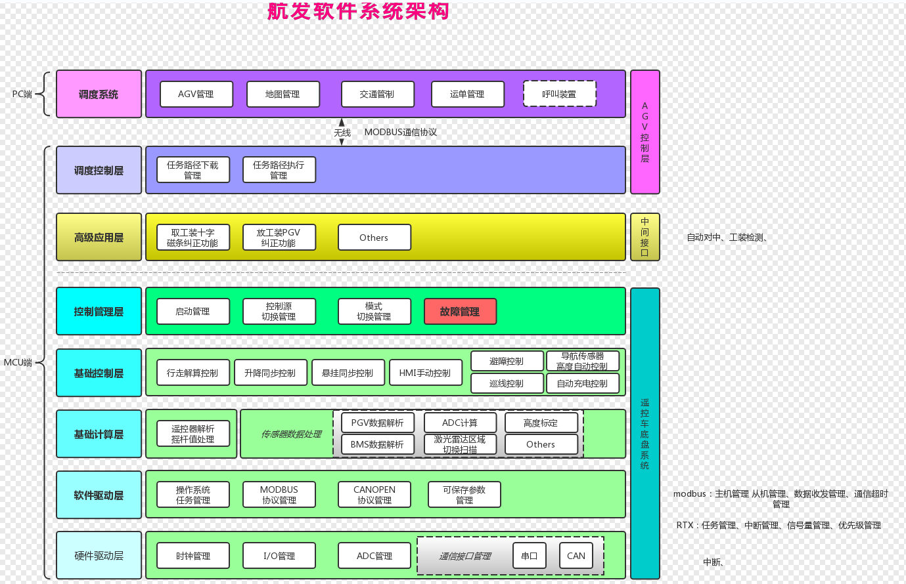

 <!-- 注释内容 
 #表示标题
 ***表示
 <kbd>[✔]</kbd>特殊符号
 -->
 
# 标准程序代码仓库  
#### 包含HAL、CBB、遥控底盘、自动部分代码、标准HMI
> ***  
## 最新更新日期： 2024年08月21日  
## 最新更新内容： 392项目现场调试返回后整理优化
> ***  
# 文件目录说明
***  
***

|文件夹   					    |描述内容  						|    备注		|
|:----:   					    |:---   					    |    :----:		|
|`AgvChassisController`         |标准底盘控制逻辑核心框架		|| 
|`app_SkeletonAGV`         		|自动部分代码					||
|`CBB `							|公共构建模块					||
|`HAL`           				|硬件接口抽象配置				||
|`Drivers`                		|主控外设 & 协议栈驱动			||
|`Libraries`       				|CMSIS & StdPeriph				||
|`User`       					|应用层代码						||
|`User_Simulator`      			|纯软件仿真模拟代码				||
|`HMI`              			|标准HMI						||
|`ExternConfig`           		|项目配置代码					||
|`Project`           			|项目工程文件（MDK4/5、SI）		||
|`Xdoc`           				|设计文档						||
|`Ztemp`           				|编译等中间临时文件				||

